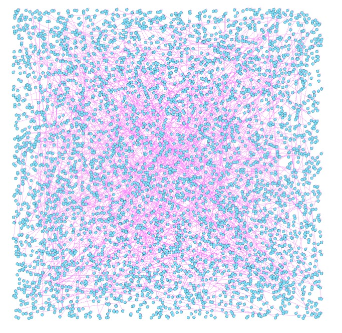

# Análise Criminal com Grafos

Projeto de análise e predição de crimes em Los Angeles da disciplina SMAC03.

## Descrição

Colunas usadas do dataset:

- Número do Relatório (DR_NO)
- Data e hora do crime (DATE OCC, TIME OCC)
- Localização (LAT, LON)
- Tipo de crime (Crm Cd, Crm Cd Desc)

Libs python utilizada
* `pandas`
* `geopy`
* `networkx`

## Funcionalidades

- Filtragem de crimes por tempo e localização
- Construção de um grafo de relações entre crimes
- Exportação do grafo em formato GML

## Estrutura do Projeto

- `script.py`: Script principal
- `Crime_Data_from_2020_to_Present.csv`: Dados originais
- `dataParse.py`: Script de filtragem de dados
- `modelo_relacionamento_crimes.gml`: Grafo gerado
- `.gitignore`: Arquivo para ignorar o CSV original no Git

## Grafo gerado


## Proposta pra predição
Usar algoritmo KNN pra busca de vizinhos mais próximos no grafo considerando uma ocorrência de crime com `lat` e `lon`. A implementação poderia ser feita completamente do zero ou utilizar lib externa como no exemplo abaixo.
```python
# Exemplo de predição: KNN baseado nos vizinhos mais próximos para prever um novo crime
from sklearn.neighbors import KNeighborsClassifier

# # transformar os dados para X (features) e y (label - tipo de crime)
X = df[['LAT', 'LON']].values
y = df['Crm Cd'].values

# # criar o modelo KNN para previsão de tipo de crime com base em coordenadas geográficas
knn = KNeighborsClassifier(n_neighbors=5)
knn.fit(X, y)

# exemplo de predição para uma nova localização
new_crime_location = [[34.0, -118.2]]  # nova coordenada para prever o tipo de crime
predicted_crime = knn.predict(new_crime_location)
# print("Predicted crime type:", predicted_crime)
```